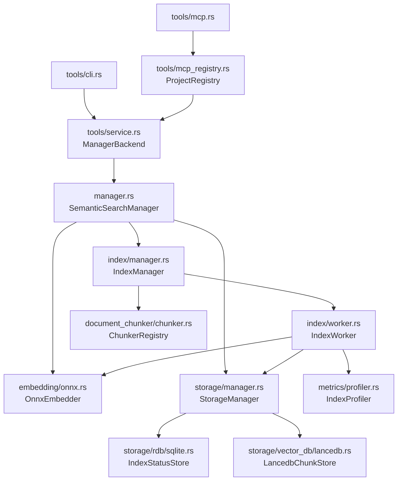
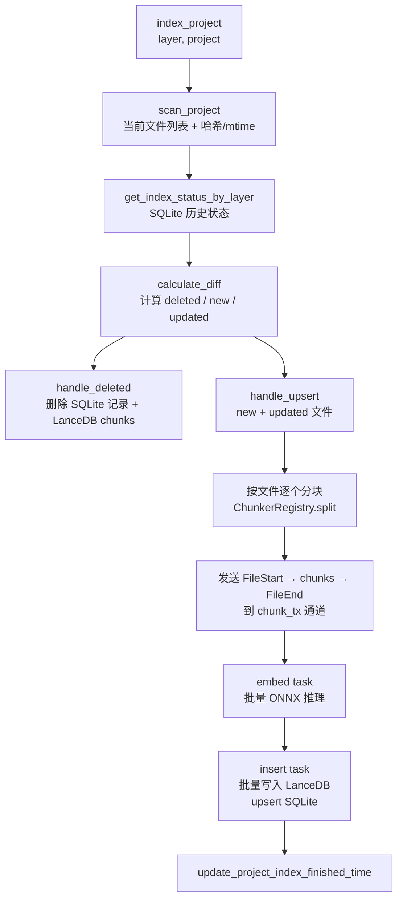

# 架构设计文档

本文档基于当前代码库全面描述语义搜索系统的**架构分层、模块职责、数据流与关键设计决策**，供开发者理解、维护和扩展系统使用。

---

## 1. 系统目标

在本地或受控环境中，对代码仓库进行**分块 → 向量嵌入 → 持久化与检索**，核心能力：

- **增量索引**：基于文件哈希与时间戳的差异计算，只对变更文件重新嵌入
- **分层索引**：支持 `File`（文件级）、`Symbol`（符号级）、`Content`（内容级）三个独立索引层
- **多语言符号提取**：通过 tree-sitter 解析 TypeScript / ArkTS，提取函数、类等符号及其 LSP Range
- **多项目隔离**：单个进程内支持多个仓库，各自维护独立存储
- **双接口暴露**：CLI（`semantic-search`）与 MCP server（`semantic-search-mcp`）

---

## 2. 总体架构

系统在逻辑上分为六层，自顶向下：

```
┌──────────────────────────────────────┐
│         工具层 / 接口层               │  CLI + MCP server
├──────────────────────────────────────┤
│         应用编排层                    │  SemanticSearchManager
├──────────────────────────────────────┤
│         索引流水线层                  │  IndexManager + IndexWorker
├──────────────────────────────────────┤
│   文档分块层        │   嵌入层        │  ChunkerRegistry | OnnxEmbedder
├──────────────────────────────────────┤
│         存储层                        │  SQLite + LanceDB
└──────────────────────────────────────┘
```

### 模块依赖关系



---

## 3. 核心领域模型

定义于 `src/common/data.rs`。

### 3.1 Project

```
Project
├── root_path: PathBuf        # 规范化的仓库根目录
├── embedding_model: String   # 模型标识（veso / baize）
├── hash: String              # root_path 的 16 位 hex 哈希（存储路径派生）
└── index_finished_time: Option<u64>  # 最近一次完整索引的 Unix 时间戳（秒）
```

一个 SQLite 数据库对应一个 Project，`index_finished_time` 是 `index_last_update_time` tool 的数据来源。

### 3.2 IndexType

```
IndexType
├── File     → LanceDB 表 "file"，FileChunker
├── Symbol   → LanceDB 表 "symbol"，TsChunker / ArkTsChunker
└── Content  → LanceDB 表 "content"（实验性）
```

### 3.3 IndexStatus

```
IndexStatus（存 SQLite，用于增量差异）
├── file_path: String     # 相对路径
├── layer: IndexType
├── file_hash: String     # 内容哈希
├── mtime / ctime: u64    # Unix 时间戳（秒）
├── size: u64             # 文件大小（字节）
└── indexed_at: u64       # 上次索引时间
```

**变更判断逻辑**（`is_changed()`）：

```
size 不同                              → 变更
OR (mtime/ctime 任一不同 AND hash 不同) → 变更
（仅时间戳变化但 hash 相同 → 不重建）
```

### 3.4 Chunk / ChunkInfo / ChunkMsg

```
ChunkInfo（chunk 的元数据）
├── layer: IndexType
├── lang: String           # 语言 ID（如 "typescript"）
├── file_path: String      # 相对路径
├── content: Option<String>  # 代码片段原文
└── range: Option<Range>   # LSP Range（行/列，仅 Symbol 层）

Chunk（索引单元）
├── embedding_content: String  # 用于嵌入的文本
│   File 层:   文件名（如 PlayerController.ts）
│   Symbol 层: 符号名（如 AudioPlayer.play）
├── info: ChunkInfo
├── embedding: Vec<f32>    # 稠密向量（维度由模型决定，默认 768）
└── is_last: bool          # 该文件的最后一个 chunk（触发写入 FileEnd）

ChunkMsg（流水线消息）
├── FileStart { file_path }  # 触发删除旧 chunks
├── Chunk(Chunk)             # 实际数据
└── FileEnd { file_status }  # 触发 upsert IndexStatus
```

### 3.5 QueryResult

```
QueryResult
├── score: f32    # 1.0 - cosine_distance，范围 [0, 1]
└── info: ChunkInfo
```

---

## 4. 索引流水线

### 4.1 总体流程



### 4.2 双通道并发架构

```
主线程 (IndexManager)
  │  FileStart / Chunk / FileEnd
  ▼
chunk_tx ──────────────────────── chunk_rx
                                      │
                              embed task (IndexWorker)
                              ├─ 缓冲至 batch_size × num_threads
                              ├─ 分发给 num_threads 个 std::thread
                              └─ 每线程调用 embedder.batch_embed()
                                      │
                              embed_tx ──── embed_rx
                                                │
                                        insert task (IndexWorker)
                                        ├─ 缓冲至 128 chunks
                                        ├─ storage.append_chunks()
                                        ├─ FileStart → delete_chunks_by_path()
                                        └─ FileEnd → upsert_index_status()
```

- 通道容量：1024（提供背压）
- 嵌入阶段批大小：`embed_batch_size × num_threads`（默认 32 × 1 = 32，可配置）
- 写入阶段批大小：固定 128 chunks
- 文件级原子替换：`FileStart` 先删除旧 chunks，`FileEnd` 写入新状态，避免部分更新残留

### 4.3 差异计算

```
calculate_diff(curr: &[IndexStatus], stored: &[IndexStatus]) -> IndexDiff

deleted = stored 中有、curr 中没有（文件被删除）
new     = curr 中有、stored 中没有（新增文件）
updated = curr 与 stored 均有，且 is_changed() == true
```

---

## 5. 存储层

### 5.1 双层设计

```
StorageManager
├── IndexStatusStore (SQLite)  → 文件级元数据，增量 diff 基准
└── LancedbChunkStore (LanceDB) → 向量数据，近邻搜索
```

### 5.2 SQLite Schema

**projects 表**

```sql
CREATE TABLE IF NOT EXISTS projects (
    root_path        TEXT NOT NULL,
    embedding_model  TEXT NOT NULL,
    hash             TEXT NOT NULL,
    index_finished_time INTEGER NOT NULL,
    PRIMARY KEY (root_path, embedding_model)
);
```

**index_status 表**

```sql
CREATE TABLE IF NOT EXISTS index_status (
    file_path   TEXT    NOT NULL,
    layer       TEXT    NOT NULL,   -- 'file' | 'symbol' | 'content'
    file_hash   TEXT    NOT NULL,
    mtime       INTEGER NOT NULL,
    ctime       INTEGER NOT NULL,
    size        INTEGER NOT NULL,
    indexed_at  INTEGER NOT NULL,
    PRIMARY KEY (file_path, layer)
) WITHOUT ROWID;

CREATE INDEX idx_index_status_layer ON index_status (layer);
```

### 5.3 LanceDB Schema

每个 layer 对应一张表（`file` / `symbol` / `content`）：

| 字段 | 类型 | 说明 |
|------|------|------|
| `id` | `Utf8` | UUID，chunk 唯一标识 |
| `layer` | `Utf8` | 索引层标识 |
| `file_path` | `Utf8` | 相对路径（用于过滤） |
| `lang` | `Utf8` | 语言 ID |
| `chunk_info` | `Utf8` | JSON 序列化的 `ChunkInfo` |
| `embedding` | `FixedSizeList[Float32; dim]` | 稠密向量，默认维度 768 |

**搜索**：余弦距离，`score = 1.0 - distance`，支持 `file_path IN (...)` 过滤

### 5.4 存储路径

```
${DATA_DIR}/semantic_search/{project_name}_{path_hash_16hex}/
├── index.db      ← SQLite
└── vectordb/     ← LanceDB

${DATA_DIR}/semantic_search/running.log   ← 所有项目共用
```

| 平台 | DATA_DIR |
|------|----------|
| macOS | `$HOME/Library/Application Support` |
| Windows | `%APPDATA%` |

---

## 6. 文档分块层

### 6.1 Chunker trait

```rust
#[async_trait]
pub trait Chunker: Send + Sync {
    async fn split(&self, path: &Path, relative_path: &str) -> Result<Vec<Chunk>>;
}
```

### 6.2 ChunkerRegistry 路由逻辑

```
路由键 ChunkerKey:
├── File              → FileChunker（所有语言）
├── Symbol(Language)  → 语言对应的 SymbolChunker
└── Content           → （预留）
```

**当前注册的 Chunker：**

| ChunkerKey | 实现 | 说明 |
|------------|------|------|
| `File` | `FileChunker` | 整文件为一个 chunk，embedding_content = 文件名 |
| `Symbol(Typescript)` | `TsChunker` | tree-sitter TypeScript 符号提取，含 LSP Range |
| `Symbol(Arkts)` | `ArkTsChunker` | tree-sitter ArkTS 符号提取（HarmonyOS 方言） |

如果某语言没有注册 Symbol Chunker，则 fallback 到 `File` 层。

### 6.3 支持的语言

当前枚举（`src/language/language.rs`，共 19 种）：

```
Plaintext, C, Cangjie, Cpp, Css, Go, Html, Java,
JavaScript, Json, Json5, Php, Python, Ruby, Rust,
TypeScript, Markdown, Arkts, Cmake
```

有 Symbol 提取能力的：`TypeScript`、`Arkts`（JavaScript 作为 TypeScript 的 fallback）

### 6.4 Symbol 提取流程

```
TsChunker / ArkTsChunker
  ├─ tree-sitter 解析源文件 → 语法树
  ├─ 遍历节点，识别：函数声明、类声明、方法定义、箭头函数等
  ├─ 提取符号名（embedding_content）
  ├─ 计算 LSP Range（start_line / start_col / end_line / end_col）
  └─ 构建 Chunk { embedding_content, info: ChunkInfo { range, ... } }
```

---

## 7. 嵌入层

### 7.1 OnnxEmbedder

```
OnnxEmbedder
├── session: Session      # ONNX Runtime 推理会话
├── tokenizer: Tokenizer  # HuggingFace tokenizer
├── dim: usize            # 输出维度（默认 768）
└── model_type: EmbeddingModelType  # Veso | Baize
```

### 7.2 批量推理流程

```
batch_embed(texts: &[String]) -> Result<Vec<Vec<f32>>>

1. batch_encode(texts)
   └─ tokenizer.encode_batch() → Vec<Encoding>

2. 构建 ONNX 输入张量 [batch_size, max_seq_len]
   ├─ input_ids:      i64
   ├─ attention_mask: i64
   └─ token_type_ids: i64（部分模型需要）

3. session.run(inputs) → ONNX 输出

4. 提取嵌入向量
   ├─ 3D 输出 [batch, seq_len, hidden_dim]：对 seq_len 维度求均值（mean pooling）
   └─ 验证 output_dim == dim

5. 返回 Vec<Vec<f32>>，每个元素为一条文本的稠密向量
```

### 7.3 配置参数

| 参数 | 环境变量 | 默认值 | 说明 |
|------|----------|--------|------|
| `model_path` | `SEMANTIC_SEARCH_MODEL` | 内置 veso | `.onnx` 文件路径 |
| `tokenizer_path` | `SEMANTIC_SEARCH_TOKENIZER` | 内置 veso | `tokenizer.json` 路径 |
| `dim` | `SEMANTIC_SEARCH_EMBEDDING_DIM` | `768` | 嵌入维度 |
| `batch_size` | `SEMANTIC_SEARCH_BATCH_SIZE` | `32` | 单线程批大小 |
| `num_threads` | `SEMANTIC_SEARCH_THREADS` | `1` | 嵌入线程数 |
| `intra_threads` | `SEMANTIC_SEARCH_INTRA_THREADS` | `1` | ONNX 算子内线程数 |

**图优化策略**：默认 `Level1`（保守，避免 FP16 模型与高级图融合不兼容）

---

## 8. 工具层

### 8.1 CLI（`src/tools/cli.rs` + `src/main.rs`）

```
semantic-search index [OPTIONS]
  --project        仓库根目录
  --layer          file | symbol | all
  --output         text | json
  --log-level      trace | debug | info | warn | error

semantic-search search [OPTIONS]
  --project        仓库根目录
  --query          语义查询字符串
  --layer          file | symbol | content
  --limit          最大返回条数（默认 10）
  --threshold      最低相似度（默认 0.5）
  --path           相对路径过滤（可重复）
```

### 8.2 MCP Server（`src/tools/mcp.rs` + `src/bin/semantic-search-mcp.rs`）

**暴露的 tools：**

| Tool | 描述 |
|------|------|
| `start_index` | 后台启动索引（非阻塞） |
| `index_progress` | 查询索引进度与状态 |
| `stop_index` | 取消索引任务 |
| `index_last_update_time` | 查询上次索引完成时间与是否过期 |
| `search` | 语义搜索（含 10 分钟自动刷新策略） |

传输协议：`stdio`（标准输入输出）

### 8.3 多项目 Registry（`src/tools/mcp_registry.rs`）

```
ProjectRegistry
└── map: Mutex<HashMap<PathKey, Arc<ManagerBackend>>>

get_or_create(project_root, shared_config)
├─ 规范化路径 → PathKey
├─ 命中缓存 → 直接返回
└─ 未命中 → 创建 SemanticSearchManager → 缓存 → 返回
```

- **ONNX Runtime 进程级共享**：所有项目共用同一份 `McpSharedConfig`（runtime path、embedding options）
- **存储路径按项目隔离**：每个 `PathKey` 独立派生 `index.db` + `vectordb/`
- **环境变量覆盖**：当 tool 请求的 `project` 与 `SEMANTIC_SEARCH_PROJECT` 相同时，`SEMANTIC_SEARCH_INDEX_DB` / `SEMANTIC_SEARCH_VECTOR_DB` 生效；其他项目使用默认平台路径

### 8.4 Service 层（`src/tools/service.rs`）

```
SemanticSearchBackend trait
├── execute_start_index(StartIndexRequest) -> CommandResponse
├── execute_index_progress(IndexProgressRequest) -> CommandResponse
├── execute_stop_index(StopIndexRequest) -> CommandResponse
└── execute_search(SearchRequest) -> CommandResponse

CommandResponse（可渲染为 text 或 JSON）
├── StartIndexResponse  { project, layers, status, usage_hint }
├── IndexProgressResponse { project, status, progress, last_error, usage_hint }
├── StopIndexResponse   { project, status, usage_hint }
└── SearchResponse      { project, query, layer, results, usage_hint, ... }
```

---

## 9. 指标与性能剖析

### IndexProfiler（`src/metrics/profiler.rs`）

```
IndexProfiler
├── spawn_sampler()          # 每 500ms 采样一次 CPU% 和内存（MB）
│   └─ 两个层（File + Symbol）均完成后自动退出
├── StageTimer               # 各阶段计时（Embedding / DbWrite）
└── IndexMetrics（最终汇总）
    ├─ total_time / per-stage time
    ├─ start/peak/avg memory (MB)
    ├─ start/peak/avg CPU (%)
    ├─ start/end storage size (LanceDB + SQLite)
    └─ handled/total file & symbol count
```

---

## 10. 依赖与运行约束

### 关键依赖版本

| 依赖 | 版本 | 用途 |
|------|------|------|
| `tokio` | 1.49.0 | 异步运行时（多线程） |
| `ort` | 2.0.0-rc.9 | ONNX Runtime（动态加载） |
| `tokenizers` | 0.21.4 | HuggingFace tokenizer |
| `lancedb` | 0.19.1 | 向量数据库 |
| `arrow-array` / `arrow-schema` | 54.2.1 | LanceDB 依赖，需版本对齐 |
| `rusqlite` | 0.31.0 | SQLite（bundled） |
| `tree-sitter` | 0.25.9 | 语法解析 |
| `tree-sitter-typescript` | 0.23.2 | TypeScript 语法 |
| `tree-sitter-arkts` | vendor | ArkTS 语法（本地 vendor） |
| `rmcp` | 1.3.0 | MCP 协议（stdio transport） |
| `ignore` | 0.4.22 | 文件遍历（遵守 .gitignore） |
| `clap` | 4 | CLI 参数解析 |

### 运行约束

- **ONNX Runtime**：需要平台对应的动态库（`.dylib` / `.dll`），内置在 `resources/onnxruntime/` 中，通过 `SEMANTIC_SEARCH_ONNX_RUNTIME` 可覆盖
- **arrow / lancedb 版本对齐**：升级任一需同步检查 `arrow-array` / `arrow-schema` 版本，版本不一致会导致编译失败
- **Linux 支持**：当前平台数据目录未支持 Linux（`platform_data_dir()` 在 Linux 返回 Error）
- **并发写入**：同一工程同时触发多个 `start_index` 会返回错误（幂等保护）；不同工程可并行索引
- **日志**：`log4rs` 写入 `${DATA_DIR}/semantic_search/running.log`，可通过 `SEMANTIC_SEARCH_LOG_PATH` 覆盖

---

## 11. 扩展指南

### 新增语言支持

1. 在 `src/language/language.rs` 的 `Language` 枚举中添加新语言
2. 实现 `Chunker` trait（参考 `src/document_chunker/symbol/ts.rs`）
3. 在 `ChunkerRegistry::register_chunkers()` 中注册对应的 `ChunkerKey::Symbol(Language::Xxx)`
4. 如使用外部 tree-sitter grammar，放入 `vendor/` 并在 `Cargo.toml` 中引用

### 新增嵌入模型

1. 将模型文件放入 `resources/embedding/{model_name}/`（`model.onnx` + `tokenizer.json`）
2. 在 `EmbeddingModelType` 枚举中添加新类型
3. 在 `src/resources/paths.rs` 中补充路径映射
4. 通过 `SEMANTIC_SEARCH_MODEL_TYPE` 环境变量启用

### 新增 MCP Tool

1. 在 `src/tools/mcp.rs` 中定义 `XxxToolRequest` 结构体（带 `schemars::JsonSchema`）
2. 在 `SemanticSearchMcp` 的 `#[tool_router]` impl 块中添加 `#[tool]` 方法
3. 在 `SemanticSearchBackend` trait 及 `ManagerBackend` impl 中添加对应方法
4. 更新 `docs/MCP.md`

---

## 相关文档

- [MCP 工具参考](./MCP.md) — 工具参数、响应格式、环境变量
- [OpenCode 集成](./OPENCODE.md) — slash command、skill、部署
- [集成说明](./INTEGRATIONS.md) — CLI 接入、环境变量完整列表
