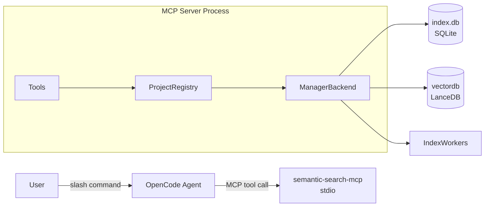

# OpenCode 集成语义搜索

本文档描述如何将 `semantic-search-mcp` 接入 **OpenCode**，包括：MCP server 配置、用户可用的 slash command、以及指导 agent 自动调用搜索能力的 skill 准则。

---

## 总体架构



- **Slash command**：提示词模板，用户输入命令后由 agent 执行对应的 MCP tool 调用。
- **MCP server（stdio）**：承载索引与搜索的协议层，内部维护多工程 registry，支持在单个进程内同时服务多个仓库。

---

## 1. 配置 MCP Server

在 OpenCode 配置文件中注册 `semantic-search` MCP server：

```jsonc
{
  "mcpServers": {
    "semantic-search": {
      "command": ["/ABS/PATH/dist/semantic-search-mcp"],
    }
  }
}
```

**配置说明：**

| 配置项 | 说明 |
|--------|------|
| `command` | `semantic-search-mcp` 可执行文件的绝对路径 |

> **多仓库提示**：单个 MCP server 进程支持多仓库。OpenCode 在切换工作区时，只需在 tool 请求中传入 `project`（当前仓库根的绝对路径），无需为每个工程单独启动 server 进程。

---

## 2. Slash Command 参考

在目标仓库（被索引的 repo）中创建 `.opencode/commands/` 目录，并添加以下 Markdown 文件。文件名即命令名，frontmatter `description` 用于在 OpenCode 中展示命令说明，正文为 agent 执行该命令时的提示词模板。

> 参考：[OpenCode 自定义命令文档](https://opencode.ai/docs/zh-cn/commands/)

本仓库 `slash_commands/` 目录提供了可直接复制使用的模板文件。

### `/index`

**功能**：在后台触发语义索引更新（非阻塞，立即返回）。

**对应 MCP tool**：`index`，参数 `layer=all`。

**何时使用**：

- 首次进入仓库，尚未建立索引
- 仓库代码发生大规模变更后
- 需要手动强制刷新索引时

---

### `/index_progress`

**功能**：查询当前索引任务的进度与状态。

**对应 MCP tool**：`index_progress`。

**输出内容**：

- `status`：`running` / `done` / `cancelled` / `error` / `idle`
- 进度：已处理 / 总计（文件数、符号数）
- 错误信息（若有）及处理建议

---

### `/stop_index`

**功能**：取消/停止当前正在运行的索引任务。

**对应 MCP tool**：`stop_index`。

---

### `/index_last_update_time`

**功能**：查询当前工程上次索引完成的时间，以及索引是否已超过过期阈值（10 分钟）。

**对应 MCP tool**：`index_last_update_time`。

**输出内容**：
- 若从未完成索引：提示建议执行 `/index`
- 若已有完成记录：展示完成时间（epoch + 人类可读格式）、距今时长、是否已过期（`stale` 字段）

---

## 3. Skill：Agent 行为准则

本节定义 agent 在使用语义搜索能力时应遵循的决策规则。

### 3.1 何时调用 `search`

满足以下任一条件时，agent 应优先调用 MCP `search`，而非直接阅读文件或全仓扫描：

**定位类**
- "X 在哪里实现 / 定义？"
- "某接口 / 函数 / struct 在哪个文件里？"

**关系类**
- "谁调用了 X？""X 会触发哪些逻辑？"
- "这段逻辑和哪些模块相关？"

**意图类（不知道精确关键词）**
- "权限校验在哪里做的？"
- "索引进度是怎么更新的？"

**跨文件 / 跨模块**
- 需要从多个位置快速收敛候选范围

**不建议用语义搜索的情况：**
- 查找字符串字面量在代码中的出现位置 → 用 `rg` / grep
- 纯概念解释，不依赖代码细节

### 3.2 `search` 默认参数建议

| 参数 | 默认值 | 说明 |
|------|--------|------|
| `layer` | `symbol` | 定位定义 / 调用关系最稳定；问文档/注释用 `content`；要更广候选用 `all` |
| `limit` | `10` | 通常足够；定位精确符号时可降至 5 |
| `threshold` | `0.5` | 过低易噪音，过高易漏结果 |
| `paths` | `[]` | 用户明确限定目录/模块时再传 |

**层选择速查：**

| 场景 | 推荐 `layer` |
|------|-------------|
| 定位函数/类/接口定义 | `symbol` |
| 查找相关文件 | `file` |
| 读文档/注释/README | `content` |
| 需要全面候选集 | `all` |

### 3.3 索引与搜索的协同策略

**用户显式命令映射：**

| 用户输入 | agent 调用 |
|----------|-----------|
| `/index` | `start_index(layer=all)` |
| `/index_progress` | `index_progress` |
| `/stop_index` | `stop_index` |
| `/index_last_update_time` | `index_last_update_time` |

**agent 主动行为：**

- 执行 `search` 前**无需强制等待索引完成**，可直接调用。
- `search` 内部会在上次索引完成超过 10 分钟时**自动触发后台刷新**（等价 `start_index(layer=all)`，非阻塞），并继续执行本次搜索。
- 若索引正在进行中，返回结果可能不完整，回答时**需明确告知用户**。

### 3.4 最小行为准则（可直接写入系统提示）

```text
当用户在问"代码在哪里/怎么实现/谁调用谁/相关模块有哪些"，优先调用 semantic-search MCP 的 search。
search 会在索引超过 10min 时自动触发后台刷新；若索引正在进行中，结果可能不完整，需在回答中说明。
当用户显式输入 /index、/index_progress、/stop_index、/index_last_update_time 时，分别调用对应的 MCP tool。
```

---

## 4. 运维注意事项

| 事项 | 说明 |
|------|------|
| 索引是耗时任务 | `/index` 非阻塞，引导用户用 `/index_progress` 轮询；大型仓库首次索引可能需要数分钟 |
| 搜索可在索引中进行 | 结果仅包含已写入的部分，agent 需在回答中注明 |
| 取消是 best-effort | `stop_index` 触发 cancel token，具体停止点取决于 worker 检查频率 |
| 同一工程重复触发 | 索引 Running 中再次调用 `index` 会返回错误，agent 应提示用户等待或先 `/stop_index` |
| 多工程并行 | 不同工程可并行索引；同一工程避免多 server 实例共享同一数据目录，否则 SQLite / LanceDB 存在并发写入风险 |

---

## 5. 交付物清单

### commands

将以下模板文件复制到目标仓库的 `.opencode/commands/` 目录：

```
.opencode/commands/
├── index.md
├── stop_index.md
├── index_progress.md
└── index_last_update_time.md
```

模板文件位于本仓库 `slash_commands/` 目录，可直接复制使用。

### skill

将 skill 文件放入目标仓库的 `.opencode/` 目录，OpenCode 会自动加载作为 agent 上下文：

```
.opencode/
└── skill.md       ← 从本仓库 skill/skill.md 复制
```

### mcp

将以下产物目录部署到目标机器，并在 OpenCode MCP 配置中指向对应路径：

```
semantic-search-mcp/
├── semantic-search-mcp            # 可执行文件（MCP server binary）
└── resources/
    ├── embedding/
    │   ├── veso/
    │   │   ├── model.onnx         # 默认嵌入模型（维度 768）
    │   │   └── tokenizer.json
    └── onnxruntime/
        ├── darwin-aarch64/
        │   └── onnxruntime.dylib
        ├── darwin-x86_64/
        │   └── onnxruntime.dylib
        └── windows-x86_64/
            └── onnxruntime.dll
```

在 OpenCode 配置中指向该目录：

```jsonc
{
  "mcpServers": {
    "semantic-search": {
      "command": ["/ABS/PATH/semantic-search-mcp/semantic-search-mcp"],
      }
    }
  }
}
```

